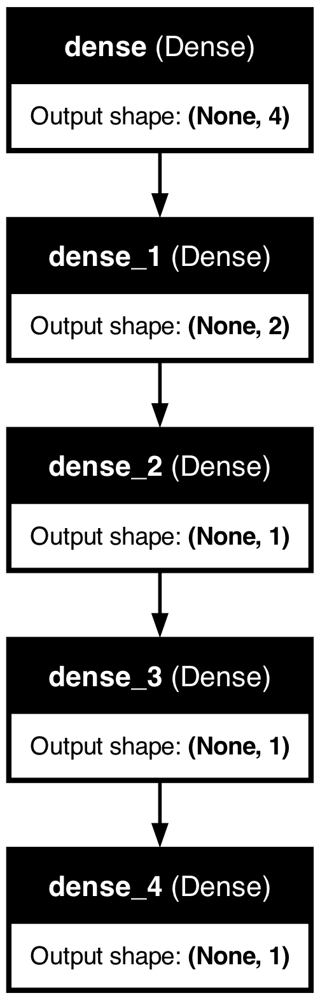

# corporate_credit_risk
**Project 4 Description**

**Objective:**
The objective of Project 4 is to collaboratively solve, analyze, or visualize a problem using machine learning (ML) techniques along with other relevant technologies. The project requirements are outlined below:

**Requirements:**
1. Identify a problem that warrants solving, analysis, or visualization.
2. Utilize machine learning (ML) techniques, incorporating the technologies covered in the course.
3. Mandatory usage of Scikit-learn or another machine learning library.
4. Employ a dataset containing a minimum of 100 records.
5. Use at least two of the following technologies:
   - Python Pandas
   - Python Matplotlib
   - HTML/CSS/Bootstrap
   - JavaScript Plotly
   - JavaScript Leaflet
   - SQL Database
   - MongoDB Database
   - Google Cloud SQL
   - Amazon AWS
   - Tableau

**Group Details:**
- Group 3 Members: Mitchell Lor, Waynei Mebrahtu, Eric Johnson, Lucinda Hodgson

**Project Title:** Predicting Corporate Credit Ratings

**Data Source:** Kaggle
[Dataset Link](https://www.kaggle.com/datasets/kirtandelwadia/corporate-credit-rating-with-financial-ratios)

**Overview:**

**Introduction:**
The project aims to leverage data analysis techniques to extract meaningful insights and predict credit ratings for corporations. By utilizing a dataset sourced from Kaggle, the group intends to preprocess the data meticulously before applying various machine learning models for predictive analysis. The models will undergo optimization and evaluation to ensure accuracy and reliability in predicting credit ratings.

**Project Details:**

1. **Data Acquisition and Preprocessing:**
   - A robust dataset comprising over 7000 records was sourced from Kaggle.
   - The data was loaded into a database using Python Pandas, followed by SQL queries for data retrieval.
   - Cleaning and preprocessing involved dropping unnecessary columns and identifying significant metrics for analysis.

2. **Initial Attempts:**
   - Initially, deep learning techniques were explored; however, encountered roadblocks due to overfitting and imbalanced data.
   - Overfitting was observed due to the simplicity of the data, leading to poor generalization.
   - Imbalanced data, where investment grade loans dominated, posed challenges for deep learning.

3. **Model Evaluation:**
   - Three models were developed and evaluated:
     - Model 1: Loss - 0.636, Accuracy - 0.667
     - Model 2: Loss - 0.490, Accuracy - 0.791
     - Model 3: Loss - 0.439, Accuracy - 0.797

   

5. **Random Forest Model for Credit Rating Forecasting:**
   - A Random Forest Classifier model was employed to forecast credit ratings based on a curated dataset.
   - Data preprocessing involved loading and cleaning data, extracting essential features, and incorporating dummy variables for categorical data representation.
   - The dataset was split into training and testing sets, and standard scaling was applied for consistent feature scaling.
   - A Random Forest Classifier with 500 decision trees was trained on the scaled data to capture complex relationships.
  
     .png)

6. **Model Evaluation and Feature Importance Analysis:**
   - The model's performance was evaluated using standard metrics such as confusion matrix, accuracy score, and classification report.
   - Additionally, a feature importance analysis was conducted to identify the significant contributors to credit rating prediction.

**Conclusion:**
By leveraging advanced machine learning techniques and meticulous data preprocessing, the Random Forest model provides a reliable approach to forecast credit ratings. This model can assist financial institutions and analysts in making informed decisions and effectively managing credit risk.
